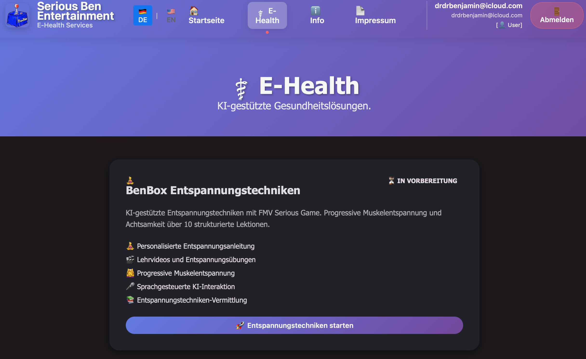
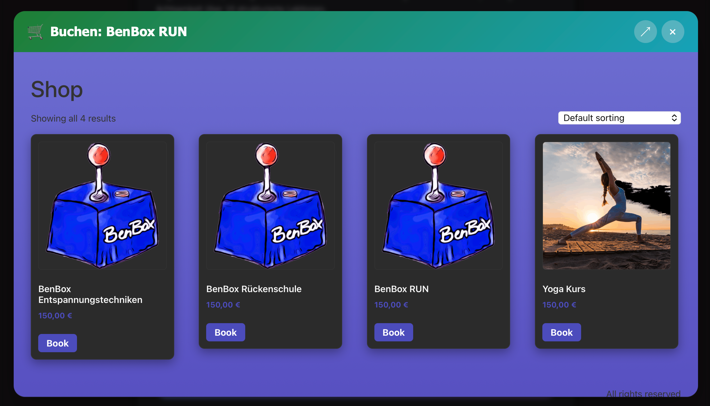
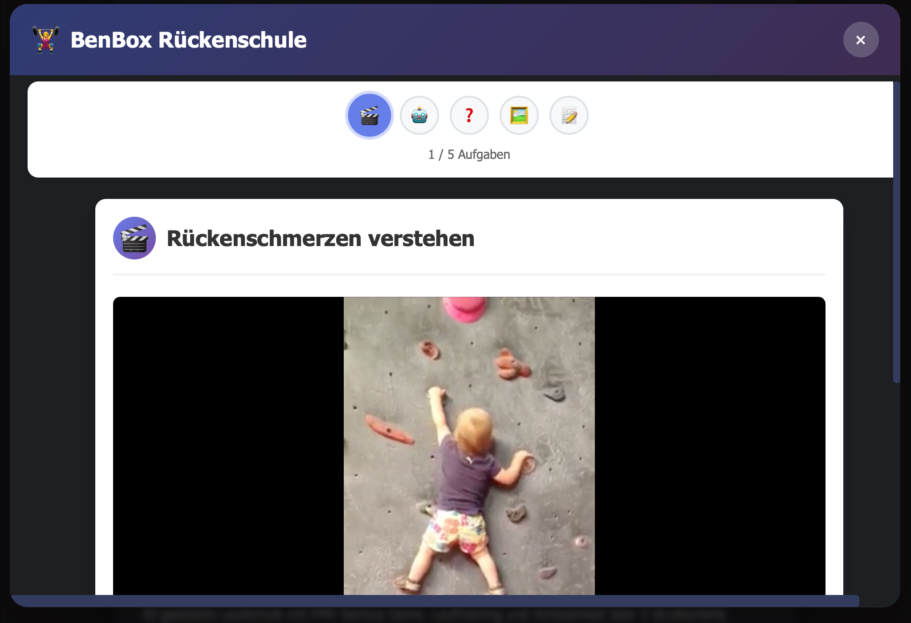

\clearpage

::: callout-note

:::

# Bussiness Description {#sec-kurzbeschreibung}

Serious Ben Entertainment operates a modular portfolio with a digital core and place-based extensions:

-  A web-based SaaS platform — [www.seriousbenentertainment.org](https://www.seriousbenentertainment.org) — that publishes a growing portfolio of **Serious Health Games** (evidence-based modules such as **BenBen - Back School**), AI-supported coaching, and free diagnostic mini-apps for lead generation.
-  An original media arm producing the **Dating Show "Love is Warm"** and **YouTube** content documenting the off-grid Monkey Bay plot, production builds, and studio life.
-  Two artisan-craft brands: **Kitenge Krafts** (fabric-based handcrafted items; inspiration and moodboard: Pinterest — https://de.pinterest.com/tamarachisi/?invite_code=eec32672190e4c3f8c5b0eb17384bf8e&sender=666603319753565587) and **Malawi Wood Kraft** (sustainably sourced wooden handcrafted items).
-  **Adventure tourism at Monkey Bay**: guided **Hike-/Bike-/Rafting tours** around the plot with **"The Serious Curse of the Bloody Monkey"** geocaching multi-cache as a real-world serious game/adventure.

The primary audience remains global and English-speaking. For Serious Health Games, domestic reimbursement schemes can be pursued per module and market. The German statutory health-insurance market (§20 SGB V primary-prevention courses) remains the first example and is treated as one go-to-market channel among several, not the foundation of the business.

## Business Idea {#sec-geschaeftsidee}

We are founding **Serious Ben Entertainment** as a creative studio with multiple complementary lines of business that reinforce one another across digital products, media, craft, and experiences. The globally accessible platform — [**www.seriousbenentertainment.org**](https://www.seriousbenentertainment.org) — acts as the digital hub that connects the following pillars:

1.  **Serious Health Games (SaaS + AI)** — self-contained modules that combine gamified mechanics with evidence-based health content. Flagship: **BenBen - Back School** (musculoskeletal prevention with posture detection via a self-developed CNN). Roadmap: relaxation training and Qi-Gong. Select modules can be certified for domestic reimbursement schemes (first target: **§20 SGB V** in Germany; typical price Dollar 150, reimbursement 75–150 Dollar).
2.  **Media & YouTube** — the original **Dating Show "Love is Warm"** plus ongoing **YouTube** content documenting the off-grid Monkey Bay plot, builds, and studio life (revenue via ads, sponsorships, brand integrations, and merch).
3.  **Artisan Crafts** — two product brands: **Kitenge Krafts** (fabric-based items; see Pinterest inspiration link above) and **Malawi Wood Kraft** (sustainably sourced wooden handcrafted items). Sales via own shop and marketplaces; content-driven commerce via YouTube/Pinterest/Instagram Shops.
4.  **Adventure Tourism & Real-World Serious Games** — guided **Hike-/Bike-/Rafting tours** around the Monkey Bay plot including a geocaching multi-cache, **"The Serious Curse of the Bloody Monkey"**, as a real-life serious game/adventure experience.
5.  **AI-supported and classical coaching** — holistic personal development and health coaching, delivered globally via video/chat.
6.  **Free diagnostic mini-apps** — questionnaires, personality games, posture/back checks as entry points that drive trust and conversion into paid offerings across the portfolio.
7.  **Lecturing at Hochschule Fresenius** — stabilizing side income during the start-up phase (Year 1/2).

The technical implementation across lines is delivered via:

-   An **Angular-based web application** ([www.seriousbenentertainment.org](https://www.seriousbenentertainment.org)) as the central SaaS and content hub
  -   **Serious Games** for playful health promotion
  -   **Conversational AI and AI-supported analyses** for personalization
  -   **Shop/checkout integrations** for Kitenge Krafts and Malawi Wood Kraft
  -   **Booking integrations** for Monkey Bay tours and experiences
-   **Scalable cloud infrastructure** (e.g., Snowflake Cloud) for flexible service delivery without high fixed costs
-   **Media production stack** for "Love is Warm" and YouTube: cameras, sound, lighting, editing and scheduling workflows
-   **In-house development** supported by my own developer skills, GitHub Copilot, and other development tools to avoid high costs, as well as best practices learned at adesso SE







::: callout-important
## Flagship Module

The **flagship Serious Health Game** is **BenBen - Back School**, a self-contained game module on the Serious Ben Entertainment platform for the prevention of back pain and musculoskeletal limitations. As a web-based SaaS application, it combines playful game mechanics with evidence-based exercises (e.g., Brügger Therapy) and posture detection driven by a self-developed deep learning model (CNN). Globally, it is sold directly to private users and employers via the platform.

For the **German domestic market**, BenBen - Back School is being prepared as the studio's first §20 SGB V certified primary-prevention course: priced at 150 Dollars, with German statutory health insurance funds reimbursing up to 150 Dollars. The Central Examination Office for Prevention (ZPP) certifies such offerings under §20 SGB V — e.g., in the category [Game-based learning / serious games / e-teaching](https://www.zentrale-pruefstelle-praevention.de/leistungen/praeventionsangebot-zertifizieren-lassen/ikt-angebote/zertifizierbare-ikt-formate/). Equivalent domestic adaptations (employer pricing in the US, NHS-aligned content in the UK, MASM/CHAM partnerships in Malawi) are evaluated for each subsequent module.
:::

### Target Groups and Positioning

The platform and studio offerings target a **global English-speaking audience** and select on-the-ground customers in Malawi:

-   **Health-conscious private individuals worldwide** — direct end customers of Serious Health Games
-   **International employers** — workplace health and wellness programs (B2B)
-   **Coaching clients** — personal and AI-supported development support
-   **Viewers and fans** — YouTube/Dating Show audiences; sponsors/brand partners
-   **Craft customers** — global buyers of Kitenge Krafts and Malawi Wood Kraft via own shop and marketplaces
-   **Tourists and travelers** — visitors to Monkey Bay seeking guided outdoor experiences
-   **Clinical and NGO partners** — integrating modules into care pathways
-   **Domestic payers** — selectively, statutory health insurance and equivalents (e.g., §20 SGB V in Germany) for module-specific reimbursement

We position the company as a **studio for evidence-based Serious Health Games and digital coaching — and a creative house for media, crafts, and real-world serious-game adventures**. The dual founding team anchors this breadth:

-   **Benjamin Gross** combines clinical practice (physiotherapist, Alexander Technique teacher, burnout coach), health-economics training (B.Sc., 2017–2019), and Data Science (M.Sc., 2023–2026, University of Edinburgh). He has built e-Health products since 2019 and brings the technical, clinical and product perspective.
-   **Phelire Chisi** is the **creative force** of the studio: a qualified **Social Worker (B.Sc.), Artist and Healer** based in Lilongwe. She leads the creative direction of the games, contributes psychosocial-counselling expertise (family work, trauma-informed creative practice, therapeutic photography and craft-based methods) and ensures that game narratives, characters and healing arcs resonate emotionally and culturally with players worldwide.

This combination — clinical depth, data-science capability, and creative-therapeutic authorship — is the studio's core differentiator and feeds directly into the development of intelligent, scalable, emotionally meaningful SaaS products.

The business model uses modern cloud technologies (e.g., Snowflake) for flexible scalability (compute and data storage) and enables location-independent use of all services via the web platform [**www.seriousbenentertainment.org**](https://www.seriousbenentertainment.org), with fixed base costs and minimal hardware investment.

## Markets {#sec-maerkte}

The **global market** for digital health applications and Serious Games continues to grow, complemented by robust adjacent markets in the **creator economy (YouTube and original formats)**, **artisanal e-commerce**, and **experience-based tourism**. The COVID-19 pandemic accelerated acceptance of digital health solutions; the current AI wave fuels interest in AI-driven coaching and assessment. In parallel, craft and experiential travel continue to benefit from content-driven discovery and niche community building. The need for low-threshold prevention offerings is rising globally due to:

-   Demographic change and increasing life expectancy in high-income markets
-   Rise of stress-related illnesses and psychological strain across cultures
-   Lack of exercise and back complaints in increasingly sedentary work and everyday life
-   The general digitalization of healthcare in both mature and emerging markets

The founding of **Serious Ben Entertainment** builds on the founders' combined experience: Benjamin's many years as a physiotherapist, personal trainer, course leader, coach and managing director of a therapy center, where he repeatedly recognized the limits of traditional care structures; and Phelire's social-work and creative-healing practice in Malawi, which provides direct insight into community-level mental-health and resilience needs. Digital, scalable solutions make it possible to overcome the limitations of local care structures and to deliver innovative health promotion globally. Prior projects illustrate the technical capability: a Bachelor's-thesis iPad Serious Game exhibited at Gamescom 2019, and a data portal for Kamuzu Central Hospital in Lilongwe, Malawi, with AI-supported assistance.

### Market Potentials

Significant growth potential exists across the studio’s lines:

-   **Workplace wellness (worldwide):** Employers in the US, UK, EU and increasingly across Africa and Asia invest in scalable digital solutions for employee health — a primary revenue channel for Serious Health Games.
-   **Direct-to-consumer health games and coaching:** Evidence-based, gamified prevention products monetize via subscriptions or per-module pricing; coaching adds higher-touch services.
-   **Creator economy (YouTube & original formats):** Monetization via ads, sponsorships, product placement, affiliate partnerships, and merch. The Dating Show "Love is Warm" provides a tentpole format; studio and off-grid content supports always-on engagement.
-   **Artisanal e-commerce (global):** Kitenge Krafts and Malawi Wood Kraft address buyers seeking authentic, ethically produced craft goods; discoverability via YouTube, Pinterest, Instagram, and marketplaces.
-   **Experience-based tourism (Monkey Bay, Malawi):** Guided Hike-/Bike-/Rafting tours with a real-world serious game appeal to adventure and culture travelers; cross-sell via content and craft brand storytelling.
-   **Domestic reimbursement schemes (selective):** For Serious Health Games, individual modules can be certified for domestic reimbursement; the German **§20 SGB V** market is the first example.

### Professional Foundations

The founders' combined interdisciplinary background forms the ideal basis for developing evidence-based, emotionally engaging digital health games:

**Benjamin Gross — clinical, technical and product foundations:**

-   **Physiotherapy, training, course provision:** Sound knowledge of movement, posture, and body awareness
-   **Alexander Technique, burnout counseling & coaching:** Expertise in mental health and behavior change
-   **Health Economics (B.Sc.):** Understanding of healthcare systems, billing models, and market mechanisms
-   **Data Science (M.Sc.):** Technical competence for software development, AI development, data analysis, and cloud infrastructure, as well as the development of a Convolutional Neural Network (CNN) for posture and movement detection
-   **Lecturer in Physiotherapy & Data Science:** Didactic skills for target-group-appropriate knowledge transfer

**Phelire Chisi — creative force, social and healing foundations:**

-   **Social Work (B.Sc.):** Family counselling, social case management, trauma-informed practice
-   **Artistic practice:** Therapeutic photography, craft-based creative methods and narrative design — directly applicable to game characters, story arcs and player-experience design
-   **Healing practice:** Community-based psychosocial healing approaches that move beyond purely talk-based counselling, integrating structured creative expression into the healing process
-   **Cultural authorship:** Lived expertise in Malawi-rooted, globally relatable storytelling that grounds the studio's games in human experience rather than mechanics alone

This combination enables the team to develop SaaS products that pair therapeutic quality and technical innovation with creative depth and economic viability.

### Market Overview

```{mermaid}
%%| fig-cap: "Serious Ben Entertainment Multi-Vertical Portfolio"
%%| fig-width: 6
%%| fig-height: 4
graph TD
  A[Serious Ben Entertainment<br/>Global Studio Hub] --> B[Serious Health Games]
  A --> C[Coaching]
  A --> D[Free Diagnostic Apps]
  A --> F[Media & YouTube\nLove is Warm]
  A --> G[Artisan Crafts\nKitenge & Wood]
  A --> H[Adventure Tours\nMonkey Bay]

  B --> B1[BenBen\nBack School]
  B --> B2[Relaxation\nTraining]
  B --> B3[Qi-Gong]

  C --> C1[Coaching]
  C --> C2[AI-supported\nCoaching]

  D --> D1[Personality\nQuestionnaires]
  D --> D2[Mini-Games\nSelf-Reflection]

  F --> F1[Dating Show\nLove is Warm]
  F --> F2[Off-grid Builds\nStudio Life]

  G --> G1[Kitenge Krafts]
  G --> G2[Malawi Wood Kraft]

  H --> H1[Hike/Bike/Raft]
  H --> H2[Geocaching\nBloody Monkey]

  B1 -.domestic adaptation.-> E[§20 SGB V\nGermany - example]
```

## Personal and Professional Qualifications {#sec-qualifikationen}

### Education and Training — Benjamin Gross

**Excerpt from health and therapy training:**

-   **State-certified physiotherapist** (2004–2007)
-   **Alexander Technique teacher** (2009–2013, four-year training)
-   **Burnout counselor** and coach
-   Diplom Brügger Therapist
-   PhysioCORE® Personal Trainer
-   Relaxation trainer (§20 SGB V certified — relevant for the German domestic adaptation)
-   Back-school instructor (§20 SGB V certified — relevant for the German domestic adaptation)
-   Qi-Gong teacher (§20 SGB V certified — relevant for the German domestic adaptation)

**Excerpt of academic qualifications:**

-   **Master of Science Data Science** (2023–2026, University of Edinburgh, UK)
-   **Bachelor of Science Health Economics** (2017–2019, Hochschule Fresenius)
-   **Train the Trainer** – Adult Education (2024)
-   **Future Work Agent** – Change Management & New Work (2020–2021)

**Excerpt of IT-technical certifications:**

-   **SnowPro Associate: Platform** (Snowflake, 2025) – Cloud Data Platform
-   **adesso certified GenAI Fundamentals** (2025) – Generative AI and LLMs
-   **ISTQB® Certified Tester Foundation Level** (2025) – Software Testing
-   **Professional Product Owner** (Scrum.org, 2024) – Agile Product Management

### Education and Training — Phelire Chisi

-   **Bachelor of Science in Social Work**
-   Professional training in **family counselling and social case management**
-   **Creative-healing practice** (therapeutic photography, craft-based methods, integrated psychosocial healing)
-   Practical experience coordinating community resources and client support in Malawi

Further details can be found in the attached CVs of both founders.

### Professional Experience and Competencies — Benjamin Gross

**Current position:**

-   **Lecturer at Hochschule Fresenius** (since 09/2025): Courses in Analytical Skills for Business and Data Science and Data Analytics

**Relevant professional experience:**

-   **Senior IT Consultant at adesso SE** (03/2024–09/2025): Data Engineering, AI development, Snowflake data platforms, RAG and agent systems
-   **Technical Advisor, Ministry of Health Malawi** (01/2022–12/2023): Data Engineering & AI in healthcare, development of health data platforms
-   **Technical Contract Manager, Deutscher Hausärzteverband** (11/2019–06/2021): Data Engineering, project management of digital health solutions
-   **Lecturer Ludwig Fresenius Schule** (07/2016–10/2019): Teaching and eLearning development
-   **Managing Director therapie centrum Rosenheim** (09/2013–06/2016): Corporate management, strategy, staff leadership
-   **Physiotherapist & Lecturer** (11/2007–08/2013): Therapy, workplace health management, personal training

**Core technical competencies:**

-   **Programming:** Python, R, JavaScript/TypeScript, Angular
-   **Data Engineering:** Snowflake, SQL, ETL processes, data modeling
-   **AI/ML:** TensorFlow, Hugging Face, OpenAI API, RAG systems
-   **DevOps:** Docker, Git/GitHub, CI/CD
-   **Health IT:** HL7v2, FHIR, HIS/PMS systems

**Pedagogical and coaching competencies:**

-   Extensive teaching experience at universities and vocational schools
-   Adult education and didactic preparation of complex content
-   Coaching training (Alexander Technique, burnout counseling)
-   Experience in developing eLearning content and Serious Games

### Professional Experience and Competencies — Phelire Chisi

**Role at Serious Ben Entertainment:** Co-Founder, Creative Director and Psychosocial-Care Lead.

**Relevant professional experience and practice:**

-   **Social work practice in Malawi:** family counselling, individual case work, linkage to community resources
-   **Creative-healing practice:** therapeutic photography sessions, craft-based group activities, narrative interviewing — used to facilitate emotional processing where words alone are limited
-   **Community engagement:** experience designing and facilitating workshops on resilience, family well-being and healing in Malawi

**Core creative competencies:**

-   **Game narrative & character design:** translating real-life healing journeys into game characters, story arcs and progression mechanics
-   **Visual / artistic direction:** photography, craft, mood and tone for the studio's titles
-   **Cultural authorship:** ensuring stories feel grounded, dignified and globally relatable
-   **Psychosocial-content review:** safeguarding the trauma-informed, emotionally safe design of all game and coaching content

## Customer Target Groups, Competition, Marketing, and Pricing {#sec-kunden-marketing}

### Customer Target Groups

The studio's offerings of Serious Ben Entertainment are aimed at different target groups worldwide with specific needs:

**Primary target groups (global):**

-   **Health-conscious private individuals** (25–65 years), English-speaking, interested in prevention and self-care
-   **People with back complaints** or stress strain who, due to time constraints, prefer digital solutions
-   **Coaching-interested individuals** who pursue personal or professional development

**Institutional partners (global):**

-   **International employers** within the framework of workplace health and wellness programs
-   **HR departments** for employee wellness programs
-   **NGOs and clinical partners** integrating game modules into care pathways

**Domestic-market institutional partners (example: Germany):**

-   **Statutory health insurance funds** for §20 SGB V prevention courses in partnership — the first concrete domestic adaptation, treated as a central market-access channel for the German market only (see *1.4.4 Marketing and Sales – Cooperations and Partnerships*). Equivalent partners in other countries will be evaluated module by module.

### Competitive Positioning

The markets we participate in are competitive yet fragmented — from fitness apps and meditation tools to creator channels, craft marketplaces, and local tour operators.

**Unique selling points of Serious Ben Entertainment:**

1.  **Interdisciplinary, dual-founder expertise:** Clinical therapy + Data Science + creative-healing/social-work practice (Phelire Chisi as creative force) underpin both digital and physical offerings.
2.  **Holistic approach:** Integration of movement, relaxation, coaching, narrative-driven Serious Games, AI support, crafts, content, and place-based adventures.
3.  **Evidence-based + culturally authored:** Therapeutic quality meets Malawian-rooted, globally relatable storytelling and design.
4.  **Freemium strategy (digital):** Free diagnostic apps as a low-threshold entry point to SaaS, coaching, and even crafts/tours via content tie-ins.
5.  **Domestic-adaptation strategy (selective):** Module-level reimbursement (e.g., Germany’s §20 SGB V) without overconstraining the global product.
6.  **Content-commerce flywheel:** YouTube and "Love is Warm" drive awareness and trust; crafts and tours monetize fandom and community interest.

**Competitive comparison (selected):**

-   Fitness/meditation apps: narrow focus, limited narrative/physical-world crossover.
-   Coaching platforms: limited integration with games and content-commerce.
-   Craft brands: often separated from owned content and experiences; limited authentic place-based storytelling.
-   Tour operators: rarely leverage original IP or real-world serious-game mechanics to deepen engagement.

### Pricing

We price transparently across digital, media-enabled, craft, and experiential offerings. Reference currency is **US Dollars (USD)**.

**Serious Health Games (global):**

-   Price: **Dollar 150.00** per module (8–10 weeks structured content)
-   Offerings: BenBen - Back School, relaxation training, Qi-Gong
-   **Domestic adaptation example — Germany (§20 SGB V):** identical 150 Dollar price; **75–150 Dollar reimbursement** by German statutory health-insurance funds; customer's own contribution **0–75 Dollar**

**Coaching Services (global):**

-   **AI-supported coaching:** Monthly subscription Dollar 30.00
-   **Coaching:** Dollar 125.00 per session (60 min.)
-   **Coaching package:** Dollar 650.00 (6 sessions)

**Media & YouTube (global):**

-   Monetization via ads (programmatic), sponsorships, product placement, affiliate partnerships, and merchandise linked to the crafts brands and tour experiences. Sponsorship packages are scoped per season of "Love is Warm" and per content series for the YouTube channel.

**Artisan Crafts — Kitenge Krafts and Malawi Wood Kraft (global e-commerce):**

-   Indicative retail ranges: small accessories Dollar 15–40; bags Dollar 40–120; wooden homeware Dollar 25–150; limited editions and bespoke items priced per design and material.
-   Sales via own shop and marketplaces; shipping priced by region and weight; sustainable packaging where feasible.

**Adventure Tourism — Monkey Bay Tours (on-site):**

-   Guided Hike-/Bike-/Rafting tours: from Dollar 25–80 per person (group-size and route dependent); private/custom routes on request.
-   Real-world serious game/geocaching multi-cache ("The Serious Curse of the Bloody Monkey"): access bundled into select tours; stand-alone experiences priced per group.

**Free offerings (lead generation):**

-   Personality questionnaires, mini self-reflection games, health check apps, tour teaser content.

Pricing reflects standard global market rates, selective reimbursability, low entry barriers via free tools, and added value through evidence-based quality, cultural authorship, and place-based experiences.

### Marketing and Sales

**Online Marketing (global):**

-   **Website:** [www.seriousbenentertainment.org](https://www.seriousbenentertainment.org) as the central platform and link-in-bio hub
-   **Content marketing:** Health topics, craft features, behind-the-scenes production, SEO for English-language search
-   **YouTube and Creator Channels:** Tentpole Dating Show "Love is Warm"; off-grid/studio build series; product and tour integrations
-   **Social media:** LinkedIn (B2B), Instagram/TikTok (B2C), Pinterest (craft inspiration and product discovery)
-   **E-mail marketing:** Newsletter with health tips, drops for new craft items, tour availability, show updates
-   **App stores (planned):** Companion mobile apps in iOS/Android (from 2027)

**Commerce & Experiences:**

-   **E-commerce:** Own shop plus marketplaces (e.g., Etsy) for Kitenge Krafts and Malawi Wood Kraft; Instagram Shop enablement
-   **Bookings:** Direct booking for Monkey Bay tours; syndication to travel/experience platforms where suitable

**Cooperations and Partnerships:**

-   **International employer and workplace-wellness partners** for Serious Health Games
-   **Clinical/NGO partners** for module integration
-   **Sponsorships and brand partners** for "Love is Warm" and YouTube
-   **Local tourism stakeholders** around Monkey Bay; visibility on Google Maps/Tripadvisor/Airbnb Experiences
-   **Domestic-adaptation example — Germany (§20 SGB V):** As previously described (ZPP certification, outreach to funds, directory listing, framework agreements, white-label where appropriate)

**Freemium Strategy:**

-   Free apps as a trust-building entry point; content-led discovery funnels to premium games, coaching, crafts, and tours
-   Evidence-based evaluations and authentic storytelling to drive conversion

**Sales channels:**

-   Direct sales via own website/e-commerce — integrated booking and payment (Dollar-led)
-   Marketplaces for crafts; creator-commerce integrations
-   B2B employer channel for Serious Health Games
-   Domestic-reimbursement directories (e.g., German §20)

### Offering Overview

```{mermaid}
%%| fig-cap: "Serious Ben Entertainment Range of Offerings"
%%| fig-width: 6
%%| fig-height: 3.5
graph LR
  A[Serious Ben Entertainment<br/>Global Studio Hub] --> B[Serious Health Games<br/>Dollar150 each]
  A --> C[Coaching]
  A --> D[Free Tools]
  A --> F[Media & YouTube<br/>Love is Warm]
  A --> G[Artisan Crafts<br/>Kitenge & Wood]
  A --> H[Adventure Tours<br/>Monkey Bay]

  B --> B1[BenBen<br/>Back School]
  B --> B2[Relaxation<br/>Training]
  B --> B3[Qi-Gong]

  C --> C1[Coaching<br/>Dollar125/session]
  C --> C2[AI Coaching<br/>Dollar30/month]

  D --> D1[Questionnaires]
  D --> D2[Mini-Games]

  F --> F1[Dating Show<br/>Love is Warm]
  F --> F2[Off-grid Builds<br/>& Studio Life]

  G --> G1[Kitenge Krafts]
  G --> G2[Malawi Wood Kraft]

  H --> H1[Hike/Bike/Raft]
  H --> H2[Geocaching<br/>Bloody Monkey]

  B1 -.domestic adaptation.-> E[§20 SGB V<br/>Germany - example]
```

## Future Outlook, Opportunities, and Risks {#sec-zukunftsaussichten}

### Market Entry Strategy

The productive launch of the SaaS platform [**www.seriousbenentertainment.org**](https://www.seriousbenentertainment.org) is planned for **early 2026** — it is already publicly accessible in version 1.0.0 (Beta). The strategy follows a multi-stage approach:

**Phase 1 (Q3 2026): Soft Launch (global, English-first)**

-   Publication of the website with free diagnostic apps for a worldwide audience
-   Launch of the first Serious Health Game module — **BenBen - Back School**
-   Start of the German §20 SGB V certification process for BenBen - Back School (first domestic adaptation)
-   Building the first global user base through the freemium strategy

**Phase 2 (Q4 2026 – Q1 2027): Product Expansion**

-   Launch of further Serious Health Game modules (relaxation training, Qi-Gong)
-   Integration of the AI-supported coaching service
-   Start of international employer / workplace-wellness cooperations
-   Completion of §20 SGB V certification and start of cooperations with German health insurance funds (domestic-adaptation channel)

**Phase 3 (Q2 2027 onwards): Scaling**

-   Expansion of B2B sales channels (international workplace wellness)
-   Development of mobile apps for iOS/Android (worldwide territories)
-   Evaluation of further domestic adaptations beyond Germany (UK, US employer schemes, Malawi/southern Africa partnerships)

### Unique Selling Points and Success Factors

**Technological strengths:**

-   Cloud-based, scalable infrastructure (Snowflake)
-   AI-supported personalization and coaching
-   Modern web technologies (Angular) for optimal user experience

**Professional strengths:**

-   Unique combination of clinical health expertise, Data Science and creative-healing/social-work practice (Phelire Chisi as creative force)
-   Domestic-adaptation strategy: e.g., §20 SGB V certification in Germany unlocks reimbursement and premium pricing in that market without forcing the global product to depend on a single national scheme
-   Evidence-based methods with scientific grounding

**Business model:**

-   Recurring revenue through SaaS subscriptions
-   Low customer acquisition costs through the freemium strategy
-   Scalability without proportional cost increase

### Opportunities

1.  **Growing global market:** Digital health and Serious Games are booming, reinforced by demographic change in mature markets and digitalization in emerging ones
2.  **Domestic-adaptation upside:** Selective domestic certifications (starting with §20 SGB V in Germany) create trust, lower price barriers and unlock premium pricing in those markets
3.  **AI trends:** Growing global interest in AI-supported coaching and assessment
4.  **Workplace-wellness potential:** Companies worldwide are increasingly investing in employee health
5.  **Network:** Existing contacts in the healthcare sector (Germany, Malawi) and creative/social-work networks (Malawi)
6.  **Lecturing:** Lecturing at Hochschule Fresenius strengthens reputation and offers synergy effects in the founding phase

### Risks and Mitigation

**Business risks:**

-   **Customer acquisition:** Slow build-up of the global user base → mitigated by the freemium model and targeted marketing
-   **Competition:** New providers → continuous innovation and quality assurance, with creative-narrative differentiation as a moat
-   **Technical complexity:** Development effort → agile development, MVP approach, modular game architecture
-   **Domestic-scheme regulation:** Changes to any single domestic scheme (e.g., §20 SGB V) → mitigated by treating each scheme as one of several go-to-market channels rather than the foundation of the business model

**Financial mitigation:**

-   **Side activity as lecturer:** Stable base income parallel to founding
-   **Low capital requirement:** Digital business model without high investment costs
-   **Flexibility:** If needed, return to employment (physiotherapy, IT consulting) is possible
-   **Personal situation:** Single, no maintenance obligations, modest lifestyle

**Operational risks:**

-   **Data protection:** Health data → strict GDPR compliance, secure cloud infrastructure
-   **Quality assurance:** Therapeutic quality → regular evaluations, user feedback
-   **Scaling:** Growth management → cloud infrastructure enables automatic scaling

### Personal Prerequisites

The founders' personal situation favours the venture:

-   **Financial flexibility:** Modest lifestyle and a low-cost living base in Lilongwe, Malawi, well-equipped for the start-up phase (2026 to 2027)
-   **Professional experience:** Prior founding and leadership experience (Benjamin: managing director of therapie centrum Rosenheim) and grass-roots social-work and creative-practice leadership (Phelire)
-   **Resilience:** Both founders have navigated financially challenging phases during training, vocational training and studies
-   **Network:** Long-standing contacts in healthcare and health-IT in Germany and Malawi, plus creative and social-work networks in Malawi
-   **Continuous further training:** Commitment to lifelong learning and adaptability across both founders

Serious Ben Entertainment is a multidisciplinary creative company that combines entertainment, tourism, AI-supported systems, handmade crafts, and digital storytelling into one business structure.
The company focuses on developing products and experiences that connect culture, creativity, wellness, and technology. Through its different divisions, the business seeks to provide meaningful entertainment, promote authentic cultural exchange, encourage tourism, and create innovative educational and lifestyle experiences.

The Serious Games division focuses on developing interactive AI-supported games and assessment systems aimed at improving physical health, and learning experiences. The Love Is Warm dating show focuses on interracial and intercultural relationships by creating emotionally engaging and culturally diverse entertainment content for global audiences.
Kitenge Krafts specializes in handmade African-inspired products using Chitenje/Kitenge fabrics, including meditation pillows, fashion accessories, home décor, and wellness products. Wood Krafts focuses on handcrafted wooden furniture, décor, and artistic products inspired by African craftsmanship and modern lifestyle aesthetics.
The Hike, Bike and Rafting Tours division focuses on eco-tourism and outdoor adventure experiences, offering hiking, biking, rafting, camping, and cultural exploration activities that showcase Malawi’s natural beauty and tourism potential.

Mission Statement    
Our mission is to create innovative and culturally meaningful entertainment, tourism, and creative experiences that connect people across cultures through technology, craftsmanship, and adventure while promoting sustainable growth and global cultural exchange.

Marketing:

1. Pricing policy
2. Advertising Plan
3. Competitive analysis
4. Competitive advantage

  OPERATIONS
  
  
  SUSTAINABLE DEVELOPMENT MEASURE OF PERFOMANCE 
  
  CRITICAL RISKS


# Profitability Calculations {#sec-wirtschaftlichkeit}

## Calculation of Required Personal Drawings {#sec-privatentnahmen}

### Cost of Living (monthly)

| Item                                                 | Amount in Dollar |
|------------------------------------------------------|------------------|
| Apartment (incl. heating and all incidental costs)   | 670.00           |
| Food, beverages, and stimulants                      | 250.00           |
| Clothing and shoes                                   | 50.00            |
| Furnishings                                          | 20.00            |
| Health and personal care                             | 15.00            |
| Transport (public transport + road bike accessories) | 65.00            |
| Communication, leisure, and culture                  | 40.00            |
| Education                                            | 50.00            |
| Other                                                | 20.00            |
| **Subtotal cost of living monthly**                  | **1,180.00**     |

### Insurance and Provident Contributions

| Item                                                     | Amount in Dollar |
|------------------------------------------------------|------------------|
| Statutory or private health and long-term care insurance | 363.00           |
| Statutory or private pension/retirement provision        | 00.00            |
| Other insurance                                          | 11.00            |
| **Total monthly**                                        | **374.00**       |

## Operational Calculations {#sec-betriebliche-berechnungen}

### Capital Requirement Plan in the Start-up Phase (Assumption: 3 months)

#### Pre-founding

| Item | Amount in Dollar |
|-------------------------------------------------------|-----------------|
| Start-up advisory | 200.00 |
| Registrations / notifications / permits (Trade Office, IHK) | 100.00 |
| Legal advice (data protection, T&Cs) | 300.00 |
| Patent, license, and franchise fees | 0.00 |
| **Total one-time founding costs** | **600.00** |

#### Ongoing Business Costs (per month)

| Item                                           | Amount in Dollar |
|------------------------------------------------|------------------|
| Further training / certifications              | 50.00            |
| Cloud hosting (STRATO V-Server, Snowflake)     | 50.00            |
| Domain & website hosting                       | 15.00            |
| Marketing and advertising (online ads, SEO)    | 300.00           |
| Office supplies incl. postage                  | 20.00            |
| Business insurance (professional liability)    | 40.00            |
| Contributions and fees                         | 50.00            |
| Telecommunications (internet, telephone)       | 30.00            |
| Tax advisor / bookkeeping                      | 150.00           |
| Other                                          | 50.00            |
| **Total ongoing operating expenses (monthly)** | **755.00**       |
| **Total operating expenses (3 months)**        | **2,265.00**     |

**Total capital requirement (start-up phase 3 months):** EUR 7,500

## Capital Requirement and Financing {#sec-kapitalbedarf}

### Financing Plan

| Item                                          | Amount in Dollar |
|-----------------------------------------------|------------------|
| **Equity**                                    |                  |
| Bank balance                                  | 17,500.00        |
| Private loans                                 | 0.00             |
| Contributions in kind (existing IT equipment) | 5,000.00         |
| **Total own funds**                           | **22,500.00**    |
| **Outside capital**                           |                  |
| Founding subsidy (6 months × Dollar2,000)          | 12,000.00        |
| Long-term loans                               | 0.00             |
| Short-term loans                              | 0.00             |
| **Total outside capital / funding**           | **12,000.00**    |
| **Total financing**                           | **34,500.00**    |
| less total capital requirement (3 months)     | -7,500.00        |
| **Surplus / shortfall**                       | **+27,000.00**   |

**Notes:**

-   Equity comprises existing cash and IT equipment (laptop, software)
-   Founding subsidy: 6 months × Dollar2,000 = Dollar12,000 (main funding)
-   The surplus serves as a liquidity reserve for further development

## Revenue, Cost, and Profit Forecast {#sec-umsatz-kosten-gewinn}

### Revenue Planning

The revenue forecast reflects a diversified, multi-vertical model with conservative assumptions for media, crafts, and tours, and a reduced emphasis on SaaS:

**Assumptions Year 1 (2026, 6 months):**

-   Serious Health Game modules: 8 modules × Dollar150 = Dollar1,200
-   Coaching: 6 sessions × Dollar125 = Dollar750
-   AI Coaching subscriptions: 12 subs × Dollar30 × ø 1 month = Dollar360
-   Media & YouTube: Dollar300
-   Artisan Crafts (Kitenge & Wood): 60 items × Dollar35 avg = Dollar2,100
-   Monkey Bay tours & real-world serious game: 20 participants × Dollar35 = Dollar700
-   **Total:** Dollar5,410

**Assumptions Year 2 (2027):**

-   Serious Health Game modules (global direct + selective §20 Germany): 40 × Dollar150 = Dollar6,000
-   Coaching: 30 sessions × Dollar120 = Dollar3,600
-   AI Coaching subscriptions: 30 subs × Dollar30 × 12 months = Dollar10,800
-   Media & YouTube: Dollar5,000
-   Artisan Crafts: 400 items × Dollar45 avg = Dollar18,000
-   Monkey Bay tours & real-world serious game: 200 participants × Dollar40 = Dollar8,000
-   Workplace-wellness cooperation: 1 company × Dollar2,000 = Dollar2,000
-   **Total:** Dollar53,400

**Assumptions Year 3 (2028):**

-   Serious Health Game modules (global direct + selective §20 Germany): 80 × Dollar150 = Dollar12,000
-   Coaching: 50 sessions × Dollar120 = Dollar6,000
-   AI Coaching subscriptions: 100 subs × Dollar30 × 12 months = Dollar36,000
-   Media & YouTube: Dollar20,000
-   Artisan Crafts: 1,000 items × Dollar50 avg = Dollar50,000
-   Monkey Bay tours & real-world serious game: 500 participants × Dollar45 = Dollar22,500
-   Workplace-wellness cooperations: 3 companies × Dollar2,500 = Dollar7,500
-   **Total:** Dollar154,000

### Chart: Company Development (Dollar)

| Year | Revenue (Dollar) | Operating Costs (Dollar) | Annual Surplus (Dollar) |
|------|-------------------|--------------------------|-------------------------|
| 2026 | 5,410             | 5,730                    | -320                    |
| 2027 | 53,400            | 15,060                   | 38,340                  |
| 2028 | 154,000           | 21,060                   | 132,940                 |

```{r}
#| echo: false
#| eval: true
#| label: fig-unternehmensentwicklung
#| fig-cap: "Revenue and Profit Development 2026-2028"
library(tidyverse)

# Creating data
jahre <- c("2026\n(6 mo.)", "2027", "2028")
umsatz <- c(5410, 53400, 154000)
kosten <- c(5730, 15060, 21060)
gewinn <- c(-320, 38340, 132940)

df <- tibble(
  Year = factor(jahre, levels = jahre),
  Revenue = umsatz,
  `Operating Costs` = kosten,
  `Annual Surplus` = gewinn
)

# Creating plot
df_long <- df |>
  pivot_longer(cols = -Year, names_to = "Category", values_to = "Amount")

ggplot(df_long, aes(x = Year, y = Amount, fill = Category)) +
  geom_col(position = "dodge") +
  scale_fill_manual(values = c("Revenue" = "#2E7D32",
                                "Operating Costs" = "#C62828",
                                "Annual Surplus" = "#1976D2")) +
  labs(title = "Revenue and Profit Development 2026-2028",
       x = "Year",
       y = "Amount in Dollar",
       fill = "") +
  theme_minimal() +
  theme(legend.position = "bottom")
```

**Notes:**

-   Year 1 (6 months): Build-up phase with low revenues and a slightly negative operating result (-Dollar662), but positive overall profitability through the founding subsidy and side income
-   Year 2: Strong revenue growth and clearly positive annual surplus
-   Year 3: Further significant revenue growth through an established product range and customer loyalty

## Liquidity Forecast {#sec-liquiditaetsvorschau}

### Income and Expenses (extrapolated and estimated)

| Item | 2026 (6 mo.) (Dollar) | Year 2027 (Dollar) | Year 2028 (Dollar) |
|------------------|-------------------|------------------|------------------|
| **Net income** |  |  |  |
| Serious Health Game modules (global + selective §20 Germany) | 1,200.00 | 6,000.00 | 12,000.00 |
| Coaching | 750.00 | 3,600.00 | 6,000.00 |
| AI Coaching subscriptions | 360.00 | 10,800.00 | 36,000.00 |
| Workplace-wellness cooperations | 0.00 | 2,000.00 | 7,500.00 |
| Media & YouTube | 300.00 | 5,000.00 | 20,000.00 |
| Artisan Crafts (Kitenge & Wood) | 2,100.00 | 18,000.00 | 50,000.00 |
| Monkey Bay tours & real-world serious game | 700.00 | 8,000.00 | 22,500.00 |
| **Total income = Gross income I** | **5,410.00** | **53,400.00** | **154,000.00** |
| less operating expenses | 5,730.00 | 15,060.00 | 21,060.00 |
| **Total operating result = Gross income II** | **-320.00** | **38,340.00** | **132,940.00** |
| Depreciation on investments | 400.00 | 400.00 | 400.00 |
| **Total basis for income tax** | **-720.00** | **37,940.00** | **132,540.00** |
| Personal drawings / cost of living | 9,324.00 | 18,648.00 | 18,648.00 |
| **Total operating result less personal drawings = Cash flow** | **-9,644.00** | **19,692.00** | **114,292.00** |
| \+ Side income (lecturing) | 4,000.00 | 8,000.00 | 8,000.00 |
| \+ Founding subsidy (6 months × Dollar2,000) | 12,000.00 | 0.00 | 0.00 |
| **Total profitability** | **6,356.00** | **27,692.00** | **122,292.00** |
| **Cumulative cash flow** | **6,356.00** | **34,048.00** | **156,340.00** |

**Notes:**

**2026 (founding year, 6 months):**

-   Start-up phase with diversified but early-stage revenues (Dollar5,410)
-   Operating costs: baseline plus small media/craft/tour overhead = Dollar5,730
-   Operating cash flow negative (-Dollar320), but founding subsidy (Dollar12,000) and side income (Dollar4,000) yield positive overall profitability of Dollar6,356
-   Personal drawings: 6 months × (Dollar1,180 cost of living + Dollar374 insurance) = Dollar9,324
-   Founding subsidy: 6 × Dollar2,000 = Dollar12,000

**2027 (Year 2):**

-   Strong multi-vertical revenue growth to Dollar53,400 (notably crafts, AI coaching, tours, media)
-   Operating costs: baseline plus added variable budgets = Dollar15,060
-   Operating annual surplus: Dollar38,340
-   Personal drawings: 12 months × Dollar1,554 = Dollar18,648
-   Cash flow after drawings: Dollar19,692; with side income (+Dollar8,000), total profitability: Dollar27,692

**2028 (Year 3):**

-   Further scale across media/crafts/tours to Dollar154,000
-   Operating costs: Dollar21,060 (assumes modest scaling of variable budgets)
-   Operating annual surplus: Dollar132,940
-   Cash flow after drawings: Dollar114,292; total profitability incl. side income: Dollar122,292
-   Cumulative cash flow: Dollar156,340

**Liquidity Safeguarding:**

-   Founding subsidy secures the first 6 months
-   Side income from university lecturing in all three years
-   Equity reserve of Dollar22,500 available for bridging
-   Low capital requirement due to digital business model
-   Positive overall profitability in all periods
-   If needed: return to employment (physiotherapy/IT) possible at any time

# Marketing Materials & Market Access {#sec-werbemittel}

## SaaS Platform {#sec-saas-plattform}

**Homepage:** [www.seriousbenentertainment.org](https://www.seriousbenentertainment.org)

The central web platform serves as the hub for all services:

**Technical implementation:**

-   **Frontend:** Angular-based single-page application
-   **Backend:** Cloud-native architecture (Snowflake, Node.js)
-   **AI integration:** Conversational AI, personalized recommendations
-   **Responsive design:** Optimized for desktop, tablet, and mobile

**Functions:**

-   User registration and management (worldwide)
-   Access to all Serious Health Game modules (with optional domestic-reimbursement workflows where applicable, e.g., §20 certificate management for the German market)
-   AI-supported coaching dashboard
-   Free diagnostic tools and questionnaires
-   Booking system for coaching
-   Multi-currency billing (Dollar-led) and domestic certificate management
-   Blog with health tips (content marketing)

## Product Portfolio {#sec-produktportfolio}

### Serious Health Game Modules (150 Dollars each, global price)

**1. BenBen - Back School – Flagship Module**

-   Serious Game for back health, with characters and narrative authored by Phelire Chisi (creative direction) and clinical content by Benjamin Gross
-   8–10 weeks structured program
-   Evidence-based exercises (Brügger Therapy and others)
-   Gamification elements and AI posture detection (CNN)
-   **Domestic adaptation example:** prepared for §20 SGB V certification in Germany (first domestic-reimbursement channel)

**2. Relaxation Training**

-   Progressive muscle relaxation
-   Mindfulness exercises
-   Audio-supported sessions

**3. Qi-Gong**

-   Video-based movement instructions
-   Step-by-step tutorials
-   Traditional Chinese movement art

### Media & YouTube

**Dating Show — "Love is Warm":**

-   Original relationship-focused format centering on empathy, culture, and community.
-   Distribution via YouTube; monetization via ads, sponsorships, product placement, and affiliated merch (craft brands).
-   Seasonal production with sponsor packages; cross-promotion of crafts and tours.

**YouTube — Off-grid Plot & Studio Life:**

-   Documentary-style build series of the Monkey Bay plot (existing: wooden shed with compost toilet, shower and kitchen; summer hut in the center; well; tents; dog house. Planned: chicken house; second kitchen with bread oven at the summer hut; further upgrades).
-   Behind-the-scenes of game production, craft design, and tour scoping; creator-commerce tie-ins.

### Artisan Crafts (Global E-commerce)

**Kitenge Krafts:**

-   Fabric-based handcrafted items (bags, accessories, home goods) inspired by Malawian design.
-   Inspiration/moodboard: Pinterest — https://de.pinterest.com/tamarachisi/?invite_code=eec32672190e4c3f8c5b0eb17384bf8e&sender=666603319753565587
-   Drops synchronized with content releases; sustainable material sourcing where possible.

**Malawi Wood Kraft:**

-   Sustainably sourced wooden handcrafted items (homeware, decor, small furniture and utility pieces where feasible).
-   Small-batch production; limited editions; custom commissions by request.

### Adventure Tourism — Monkey Bay (On-site)

**Guided Hike-/Bike-/Rafting Tours:**

-   Curated routes around Monkey Bay with varying difficulty and duration; safety-first planning and equipment guidance.
-   Group and private bookings; optional photo/video packages produced by the media arm.

**Real-world Serious Game — Geocaching Multi-Cache:**

-   "The Serious Curse of the Bloody Monkey" — a narrative-driven, clue-based multi-cache that turns the environment into a live serious game.
-   Bundled with select tours or offered as a stand-alone group experience.

### Coaching Services

**AI-supported Coaching (Dollar30.00/month):**

-   Conversational AI for daily reflection
-   Personalized development plans
-   Behavior tracking and feedback
-   Evidence-based recommendations

**Coaching (Dollar125/session):**

-   60-minute individual sessions
-   Video coaching via secure platform
-   Holistic approach (body, mind, behavior)
-   Focus: burnout prevention, work-life balance, leadership skills

### Free Lead Generation

**Diagnostic Apps:** - Personality questionnaires (e.g., burnout risk) - Back check - Stress level assessment - Mini self-reflection games

After evaluation: Personalized recommendations for paid offerings

## Mobile App (planned) {#sec-mobile-app}

**App Name:** BenBen

**Status:** Development planned for 2027 (worldwide territories)

**Functions:** - All web functions as a native app - Offline use of selected content - Push notifications for coaching - Integration with Apple Health / Google Fit - Optional support for geocaching clue logs and tour check-ins

# Appendix {#sec-anhang}

## Information on the Founding Subsidy {#sec-gruenderzuschuss}

The founding subsidy from the Federal Employment Agency is a central funding measure for new business creation. The application is made in two phases:

**Phase 1 (mandatory benefit if requirements are met):**

-   Duration: 6 months
-   Amount: Most recently received unemployment benefit + Dollar300 lump sum
-   In my case: approx. Dollar1,700 ALG I + Dollar300 = **Dollar2,000 monthly**
-   Total: **Dollar12,000** for 6 months

**Phase 2 (discretionary benefit):**

-   Duration: a further 9 months
-   Amount: Dollar300 monthly
-   Total: Dollar2,700 (if granted)

**Requirements (met):**

-   Receipt of unemployment benefit I with a remaining entitlement of at least 150 days
-   Viable business concept (this business plan)
-   Personal and professional suitability (demonstrated by qualifications)
-   Statement from a competent body (e.g., Cologne Business)

**Significance for the founding:**

-   Securing cost of living during the start-up phase
-   Enables focus on product development and market build-up
-   Significantly reduces financial risk
-   Additionally: continuation of social insurances

## Response to the Cologne Business Checklist {#sec-cologne-business}

The following overview addresses the central questions of the Cologne Business checklist for founding preparation. Although the studio operates globally, this checklist is retained as it is required for the German founding-subsidy application (one of several funding channels evaluated):

**1. Personal and professional prerequisites:**

-   [x] Comprehensive qualification across the founding team in healthcare, IT, social work and creative practice
-   [x] Commercial knowledge through B.Sc. Health Economics and managing director experience (Benjamin)
-   [x] Industry experience: 20+ years in healthcare, 5+ years in health IT/Data Science (Benjamin); social-work and creative-healing practice in Malawi (Phelire)
-   [x] Family backing in place
-   [x] Time commitments calculated and accepted

**2. Founding concept and market opportunities:**

-   [x] Clearly defined offering: Serious Health Games (SaaS + AI), media ("Love is Warm" + YouTube), artisan crafts (Kitenge Krafts, Malawi Wood Kraft), Monkey Bay tours & real-world serious games, plus coaching — unified via a global studio platform
-   [x] Market need: growing global market for digital health and Serious Games
-   [x] Target groups defined: private individuals worldwide, international employers, NGOs and clinical partners; selectively, domestic health-insurance funds (Germany §20 SGB V as first example)
-   [x] Marketing concept: freemium strategy, English-first online marketing

**3. Competitive situation:**

-   [x] Competitors known and analyzed
-   [x] Prices calculated in line with the global market
-   [x] Unique selling points clearly defined: interdisciplinary clinical-creative expertise, AI integration, domestic-adaptation strategy
-   [x] Sales methods: SaaS platform direct, B2B employer channel, plus selective domestic-reimbursement directories (e.g., German §20 directories)

**4. Location choice:**

-   [x] Digital business model: location-independent
-   [x] Operational base: Lilongwe, Malawi (low cost base, both founders resident there); virtual presence worldwide
-   [x] Customer base reachable globally via the platform
-   [x] Costs minimal: home-office setup, no permanent commercial real-estate cost

**5. Legal form:**

-   Sole proprietorship / freelancer (coach, IT service provider) for the founding phase
-   Possible later conversion into a corporate vehicle (e.g., GmbH or Malawian company structure) in the case of strong growth or institutional investment

**6. Permits:**

-   Trade registration required
-   §20 SGB V certification for the German market (one domestic-adaptation step; not required for global sales)
-   Data protection: GDPR compliance for European users, plus equivalent regulations in other markets where applicable

**7. Profitability:**

-   [x] Detailed profitability forecast
-   [x] Break-even from Year 3 planned
-   [x] Costs fully calculated (private + business)

**8. Financing:**

-   [x] Capital requirement determined: Dollar7,500
-   [x] Equity: Dollar22,500
-   [x] German founding subsidy applied for: Dollar12,000 (one of several funding channels)
-   [x] Liquidity secured through side income (lecturing)

**9. Insurance:**

-   Professional liability insurance (coach/IT consultant): Dollar40 monthly
-   Private health insurance: Dollar363 monthly
-   Pension insurance: Dollar00.00 monthly
    -   Retirement provision through private property in Malawi (Phelire's home country, with low cost of living)

\clearpage